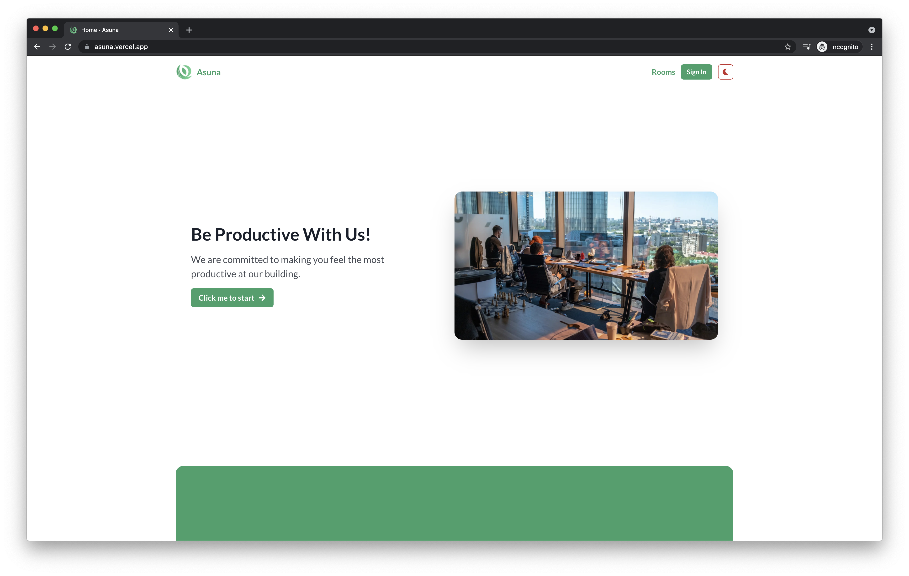

# Asuna

Project Asuna is an open-source, scalable, 'brand-ready', and user-friendly building management system. This full-stack web application is open-source, under MIT License, and the research about this is published in a free-for-all, strictly non-commercial open-access academic journal about science and technology.

Check out the live version of the application by clicking on the link in the repository's description.



## Disclaimer

Project Asuna is **strictly non-commercial** and is used for **education and research purposes only**. You can use this as a base if you want to create a scalable system with the accompanying tech stack, but please do not use this project 'as it is' in your production scenarios. All of the assets in this website are dummy data and dummy assets, and all rights reserved to their original owners of the assets.

## Abstract

Co-working spaces and offices are two of the most growing and essential businesses in Asian countries. Several factors contribute to the development of this business, such as the offered interiors, facilities, events, etc. However, the most important factor for the development of this business is the community itself, as it can generally result in a collaborative environment where one could collaborate or assist each other. In this research, we implement a highly scalable and flexible information system for offices and co-working spaces building management. This research also encompasses creating a friendly user interface that conforms to the Eight Golden Rules. Several cutting-edge technologies, such as Next.js, Chakra UI, Express.js, Mongo DB, Vercel, and Heroku, are used in the development phase of this system. The prototype built then is tested by using Technology Acceptance Model. We got a satisfactory result, where most respondents claimed that the system could be used in production phase due to its ease of use, performance, and simplicity to manage the business process. It is also proven that scalability will not be a problem when using this system because the technologies used are always ready to be scaled.

**Keywords**: Building Management System, co-working spaces, cutting-edge technologies, offices, Technology Acceptance Model.

## Introduction

Coworking space is one of the newest business trends in Indonesia and Asian countries in general (Bouncken, 2016). One of the most important metric that we have to understand in order for these kinds of business to flourish is the community of the coworking space. People enjoy coworking spaces with great facilities and good communities (Seo, 2017). If handled correctly, coworking space could make people feel connected to one another and cause them to enjoy the environment, and even create new social circles along the way (Bianchi, 2018).

There have not been a single application to manage these coworking spaces with extremely flexibility. In this application, flexibility means the ability for one to create _n_ rooms and floors, where _n_ itself means infinite. In short, this application is an open-source building management system that allows one to create infinite number of rooms and floors for their own buildings. Users of this application could also place their orders online, shall this application comes to the production version.

Not only built with performance and scalability in mind, this research also encompasses on how to create a friendly user interface to create a simple personal brand. We use assets and brands in order to showcase an example of the previous statement.

## Tech Stack

- JavaScript (programming language)
- Next.js (front-end)
- Chakra UI (front-end framework)
- Express.js (back-end)
- MongoDB (Atlas) (database, and database on cloud)
- Vercel (front-end hosting)
- Heroku (back-end hosting)
- GitHub Actions (CI/CD)

## Features

- Simple, colorful, but intuitive UI. This is subjective and differs according to the reader's interpretation.
- Ability to create infinite amount of rooms and floors. Only the reader's database size limits the number.
- Users can book a room, edit their own profile, and see their transactions.
- Multiple role support: user, admin, owner.
- Admins can perform CRUD operations on floors, rooms, employees.
- Admins can manage the available orders from the users. An admin can change the status or cancel an available order.
- Admins can see the earnings of the lifetime of this application.
- Admins can create visitors via an interface in the admin panel.
- Admins can create vouchers via API endpoints.
- Dark mode support for the front-end.
- High-performance support with pre-loaded pages, image lazy-loading, and caching.
- Server-side rendering support for pages requiring authentication.
- API-proxy via Next.js's serverless functions to provide extended security.
- Personal and secure authentication utilizing httpOnly / sameSite cookies and JWT (stateless but secure).
- Accessibility support (`a11y`).

## Requirements

- [Node.js 14+](https://nodejs.org/)
- [Yarn 1.22+](https://yarnpkg.com/)
- [MongoDB Atlas](https://www.mongodb.com/)

## Installation

To use this repository, both front-end and back-end must be active simultaneously. We will describe on how to set up each parts. As an initial setup, please clone the repository first.

- Clone the repository first.

```bash
git clone https://github.com/lauslim12/Asuna.git
cd Asuna
```

For the next steps, it is assumed that your working directory is `Asuna`, the root directory of this repository.

### Web Setup

- Switch to the `web` directory.

```bash
cd web
```

- Then, we have to fill the environment variables for both `web` and `api`. For the `web`, the settings are as follows.

```bash
export JWT_COOKIE_EXPIRES_IN=<YOUR_VARIABLE>
export PRIVATE_API_URL=<YOUR_VARIABLE>
export NEXT_PUBLIC_API_URL=<YOUR_VARIABLE>
```

- Alternatively, you can change the `.env.development` file and set the variables from there. Don't forget to rename it to `.env.local` so that it can be used.

```bash
nano .env.development
mv .env.development .env.local
```

- Install the website!

```bash
yarn --frozen-lockfile
```

- Start the website in development mode.

```bash
yarn dev
```

- Start the website in production mode.

```bash
yarn build
yarn start
```

### API Setup

- You need to spawn another terminal process. Change to the `api` directory.

```bash
cd api
```

- For the `api`, the environment variables that you need to fill are as follows.

```bash
export CLIENT_SIDE_URL=...
export DATABASE= # this has to be your 'complete URL string' - complete with username, password, and database name
export JWT_SECRET=
export JWT_EXPIRES_IN=
export JWT_COOKIE_EXPIRES_IN=
```

- Or, same as above, change the `.env.development` file and rename it to `.env`.

```bash
nano .env.development
mv .env.development .env
```

- Then, we can just install the application.

```bash
yarn --frozen-lockfile
```

- Before starting our API, we migrate the database first with dummy data.

```bash
yarn migrate
```

- Start our API. Remember we need two terminal processes, one for web, and one for API!

```bash
yarn dev
```

- Or you can also start the API in production mode.

```bash
yarn start
```

You're totally done! Open `http://localhost:3001` for the web frontend, and `http://localhost:3000` for the API backend.

## Deployment

GitHub Actions have already been set in this repository to implement the CI/CD part of the web application. It will deploy the frontend to [Vercel](https://vercel.com/), and will deploy the backend to [Heroku](https://www.heroku.com/).

## Updating

To update the dependencies, you can run the following commands in both `api` and `web`.

```bash
yarn outdated
yarn upgrade-interactive --latest
```

## Contribution

I accept all kinds of contributions. Feel free to submit a pull request or submit an issue if you encounter any issues!

## License

This application is licensed under MIT License, and the research paper is under Creative Commons. For the application's license, please see the `LICENSE` file for more information.

## Acknowledgements

In some parts of the website, we use assets from Unsplash and Genshin Impact (for the room picture only) in order to make a user-friendly interface and as an example on how to implement a simple personal brand (two topics that we also investigate and research here, as stated above). All rights reserved to their respective owners. We have both acknowledged and cited all of the assets' respective owners in the research paper and in this repository properly.

## References

Following are the scholarly references for this research project.

- Alsaqqa, S., Sawalha, S., & Abdel-Nabi, H. (2020). Agile Software Development: Methodologies and Trends. International Journal of Interactive Mobile Technologies (IJIM), 14(11), 246–270. <https://doi.org/10.3991/ijim.v14i11.13269>

- Aottiwerch, N., & Kokaew, U. (2017). Design Computer-assisted Learning in an Online Augmented Reality Environment based on Shneiderman’s Eight Golden Rules. 2017 14th International Joint Conference on Computer Science and Software Engineering (JCSSE), 1–5. <https://doi.org/10.1109/JCSSE.2017.8025926>

- Bianchi, F., Casnici, N., & Squazzoni, F. (2018). Solidarity as a Byproduct of Professional Collaboration: Social Support and Trust in a Coworking Space. Social Networks, 54, 61–72. <https://doi.org/10.1016/j.socnet.2017.12.002>

- Bouncken, R. B., Clauss, T., & Reuschl, A. (2016). Coworking-spaces in Asia: A Business Model Design Perspective. SMS Special Conference Hong Kong 2016.

- Bouncken, R. B., Laudien, S. M., Fredrich, V., & Görmar, L. (2018). Coopetition in Coworking-Spaces: Value Creation and Appropriation Tensions in an Entrepreneurial Space. Review of Managerial Science, 12(2), 385–410. <https://doi.org/10.1007/s11846-017-0267-7>

- Davis, F. D. (1989). Perceived Usefulness, Perceived Ease of Use, and User Acceptance of Information Technology. MIS Quarterly, 13(3), 319–340. <https://doi.org/10.2307/249008>

- Dhammayanti, K., Wicaksana, A., & Hansun, S. (2019). Position Placement DSS Using Profile Matching and Analytical Hierarchy Process. International Journal of Scientific & Technology Research, 8(11), 204– 207. <http://www.ijstr.org/final-print/nov2019-Position-Placement-Dss-Using-Profile-Matching-AndAnalytical-Hierarchy-Process.pdf>

- Gonçalves, L. (2018). Scrum: The Methodology to Become More Agile. Controlling & Management Review, 62(4), 40–42. <https://doi.org/10.1007/s12176-018-0020-3>

- Hansun, S. (2013). A new approach of moving average method in time series analysis. 2013 Conference on New Media Studies (CoNMedia), 1–4. <https://doi.org/10.1109/CoNMedia.2013.6708545>

- Hansun, S., & Suryadibrata, A. (2021). Gold Price Prediction in COVID-19 Era. International Journal of Computational Intelligence in Control, 13(2). <https://www.mukpublications.com/ijcic-v13-2-2021.php>

- heroku.com. (n.d.). Heroku. Retrieved June 22, 2021, from <https://www.heroku.com/>

- Hidalgo, E. S. (2019). Adapting the Scrum Framework for Agile Project Management in Science: Case Study of a Distributed Research Initiative. Heliyon, 5(3), e01447. <https://doi.org/10.1016/j.heliyon.2019.e01447>

- Khalid, A., Butt, S. A., Jamal, T., & Gochhait, S. (2020). Agile Scrum Issues at Large-Scale Distributed Projects. International Journal of Software Innovation, 8(2), 85–94. <https://doi.org/10.4018/IJSI.2020040106>

- Mittal, A. (2013). E-commerce: It’s Impact on Consumer Behavior. Global Journal of Management and Business Studies, 3(2), 131–138. <https://www.ripublication.com/gjmbs_spl/gjmbsv3n2spl_09.pdf>

- Nugraha, A., & Hansun, S. (2020). Fiturebot: CS Chatbot Application using Nazief-Adriani Algorithm. International Journal of Emerging Trends in Engineering Research, 8(2), 350–354. <https://doi.org/10.30534/ijeter/2020/18822020>

- Seo, J., Lysiankova, L., Ock, Y.-S., & Chun, D. (2017). Priorities of Coworking Space Operation Based on Comparison of the Hosts and Users’ Perspectives. Sustainability, 9(8), 1494. <https://doi.org/10.3390/su9081494>

- Sharma, A., Thung, F., Kochhar, P. S., Sulistya, A., & Lo, D. (2017). Cataloging GitHub Repositories. Proceedings of the 21st International Conference on Evaluation and Assessment in Software Engineering, 314– 319. <https://doi.org/10.1145/3084226.3084287>

- Srivastava, A., Bhardwaj, S., & Saraswat, S. (2017). SCRUM Model for Agile Methodology. 2017 International Conference on Computing, Communication and Automation (ICCCA), 864–869. <https://doi.org/10.1109/CCAA.2017.8229928>

- Vercel. (2021). Next.js on Vercel. <https://vercel.com/docs/next.js/overview>
