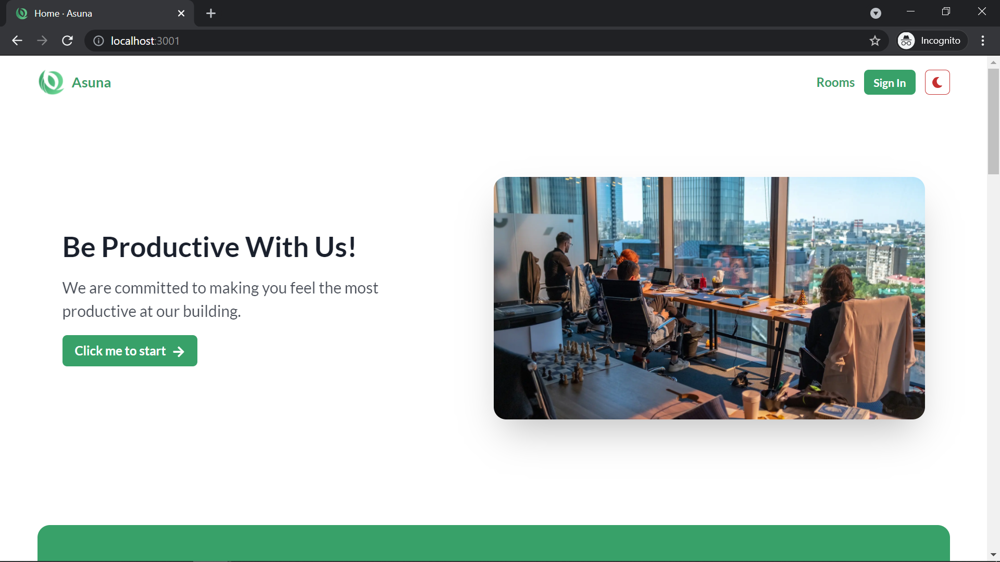

# Asuna

Project Asuna is an open-source building management system. This full-stack web application is open-source, under MIT License and is published in Indian Journal of Economics and Business, Vol. 20 No. 2 (July - December 2021).

Check out the research paper [by clicking me](http://www.ashwinanokha.com/ijeb-vol20-2-2021.php)!



Authors: Nicholas Dwiarto Wirasbawa, M. Dzulfiqar Ramadhan Wibawanto, Albert Kosasi, Seng Hansun.

## Disclaimer

Project Asuna is **strictly non-commercial** and is used for **education and research purposes only**. You can use this as a base if you want to create a scalable system with the accompanying tech stack, but please do not use this project 'as it is' in your production scenarios. All of the assets in this website are dummy data and dummy assets, and all rights reserved to their original owners of the assets.

## Introduction

Coworking space is one of the newest business trends in Indonesia and Asian countries in general (Bouncken, 2016). One of the most important metric that we have to understand in order for these kinds of business to flourish is the community of the coworking space. People enjoy coworking spaces with great facilities and good communities (Seo, 2017). If handled correctly, coworking space could make people feel connected to one another and cause them to enjoy the environment, and even create new social circles along the way (Bianchi, 2018).

There have not been a single application to manage these coworking spaces with extremely flexibility. In this application, flexibility means the ability for one to create _n_ rooms and floors, where _n_ itself means infinite. In short, this application is an open-source building management system that allows one to create infinite number of rooms and floors for their own buildings. Users of this application could also place their orders online, shall this application comes to the production version.

This application is built with performance and scalability in mind.

## Architecture

- JavaScript (main programming language)
- Next.js (front-end)
- Chakra UI (front-end framework)
- Express.js (back-end)
- MongoDB (database)
- Vercel (front-end hosting)
- Heroku (back-end hosting)
- MongoDB Atlas (database on cloud)

## Features

- Simple, colorful, but intuitive UI. This is subjective and differs according to the reader's interpretation.
- Ability to create infinite amount of rooms and floors. Only the reader's database size limits the number.
- Users can book a room, edit their own profile, and see their transactions.
- Multiple role support: user, admin, owner.
- Admins can perform CRUD operations on floors, rooms, employees.
- Admins can manage the available orders from the users. An admin can change the status or cancel an available order.
- Admins can see the earnings of the lifetime of this application.
- Admins can create visitors via an interface in the admin panel.
- Admins can create vouchers via API endpoints.
- Dark mode support for the front-end.
- High-performance support with pre-loaded pages, image lazy-loading, and caching.
- Server-side rendering support for pages requiring authentication.
- API-proxy via Next.js's serverless functions to provide extended security.
- Personal and secure authentication utilizing httpOnly / sameSite cookies and JWT (stateless but secure).
- Accessibility support (`a11y`).

## Installation

To use this repository, both front-end and back-end must be active simultaneously.

```bash
git clone https://github.com/lauslim12/Asuna.git
cd Asuna
```

Then, we have to fill the environment variables for both `web` and `api`. For the `web`, the settings are as follows.

```bash
export JWT_COOKIE_EXPIRES_IN=<YOUR_VARIABLE>
export PRIVATE_API_URL=<YOUR_VARIABLE>
export NEXT_PUBLIC_API_URL=<YOUR_VARIABLE>
```

Alternatively, you can change the `.env.development` file and set the variables from there. Don't forget to rename it to `.env` so that it can be used.

For the `api`, the settings are as follows.

```bash
export CLIENT_SIDE_URL=...
export DATABASE_PASSWORD=
export DATABASE_LOCAL=
export DATABASE=
export JWT_SECRET=
export JWT_EXPIRES_IN=
export JWT_COOKIE_EXPIRES_IN=
```

Or, same as above, change the `.env.development` file and rename it to `.env`.

Then, we can simply just install the application.

```bash
npm install
```

Before starting our application, we migrate the database first.

```bash
npm run migrate
```

Start our application. Remember we need two terminal processes!

```bash
# terminal 1
cd Asuna/web/
npm run dev

# terminal 2
cd Asuna/api
npm run dev
```

You're done! Open `http://localhost:3001` for the web frontend, and `http://localhost:3000` for the API backend.

## Deployment

Before doing this, ensure that the current working directory is `Asuna`. In order to deploy the back-end, do the following command.

```bash
git subtree push --prefix api heroku master
```

To deploy the front-end, do the following command. You have to be inside `Asuna/web`.

```bash
npx vercel # preview mode
npx vercel --prod # production mode
```

To prevent spamming of emails, I did not set up a hook that would instantly perform deployment after merging to the remote repository.

## Update

To update the dependencies, simply run:

```bash
cd Asuna/web
npm run check-updates
npm run update-deps

cd Asuna/api
npm run check-updates
npm run update-deps
```

## Contribution

I accept all kinds of contributions. Feel free to submit a pull request or submit an issue if you encounter any issues!

## License

This application is licensed under MIT License, and the research paper is under Creative Commons. For the application's license, please see the `LICENSE` file for more information.

## Credits

In some parts of the website, we use assets from Unsplash and Genshin Impact (for the room picture only). All rights reserved to their respective owners. We have both acknowledged and cited all of the assets' respective owners in the research paper properly.
